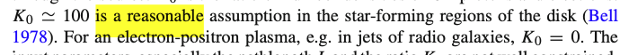

7.18.25

Took 100 training samples and ran them through 4 experiments at top-k 1000: compare to chunks (with and without previous 3 sentences query expansion) and compare to contributions (also with and without query expansion). 16 samples failed to retrieve all target doi's.

## Contributions, no query expansion
### Failure 1
```text
source_doi: 10.1146/annurev-astro-082812-140953
sent_original: Tacconi et al. (2010 , 2013 ) used this technique to identify samples of CSGs at z ∼ 1 to 3 for CO observations.
sent_no_cit: [REF] ) used this technique to identify samples of CSGs at z ∼ 1 to 3 for CO observations.
sent_idx: 361
citation_dois: ['10.1038/nature08773', '10.1088/0004-637X/768/1/74']
pubdate: 2013-08-01
resolved_bibcodes: ['2010Natur.463..781T', '2013ApJ...768...74T']
expanded_query: [REF] ) used this technique to identify samples of CSGs at z ∼ 1 to 3 for CO observations.
first_rank: 4
last_rank: None
```

This query is really more about the technique used in the original paper to arrive at the contribution, rather than the contribution itself.

The contributions for the unretrieved doi mention the findings but not the technique used, so the relevant terms never surfaced in the contributions.

### Failure 2
```text
source_doi: 10.1007/s00159-022-00144-z
sent_original: In Table 2 , that is a slightly modified version of Table 1 of Romano et al. ( 2017 ), determinations of , , and in a number of local and high-redshift objects (see Sect. 3.2.1 ) are reported.
sent_no_cit: In Table 2 , that is a slightly modified version of Table 1 of [REF], determinations of , , and in a number of local and high-redshift objects (see Sect. 3.2.1 ) are reported.
sent_idx: 678
citation_dois: ['10.1093/mnras/stx1197']
pubdate: 2022-12-01
resolved_bibcodes: ['2017MNRAS.470..401R']
expanded_query: In Table 2 , that is a slightly modified version of Table 1 of [REF], determinations of , , and in a number of local and high-redshift objects (see Sect. 3.2.1 ) are reported.
first_rank: None
last_rank: None
```

There is data missing in the query around the double-commas which didn't get captured in digitization (OCR / math recognition error):


When I manually add the isotopes back into the query, the target doi retrieves at rank 45 with a distance of 0.282:
```text
text        Demonstrates the ability to constrain the stellar IMF in galaxies using C, O, and N isotope abundance ratios.
doi                                                                                                 10.1093/mnras/stx1197
pubdate                                                                                                        2017-09-01
distance                                                                                                         0.282092
Name: 44, dtype: object
```

### Failure 3
```text
Query:
source_doi: 10.1007/s00159-015-0084-4
sent_original: is a reasonable assumption in the star-forming regions of the disk (Bell 1978 ).
sent_no_cit: is a reasonable assumption in the star-forming regions of the disk ([REF] ).
sent_idx: 118
citation_dois: ['10.1093/mnras/182.3.443']
pubdate: 2015-12-01
resolved_bibcodes: ['1978MNRAS.182..443B']
expanded_query: is a reasonable assumption in the star-forming regions of the disk ([REF] ).
first_rank: None
last_rank: None

First Result:
text: Optically thick starburst disks have characteristic properties: flux F ~ 10^13 L_solar kpc^-2, star formation rate per unit area Σ˙* ~ 10^3 M_solar yr^-1 kpc^-2, and dust effective temperature T_eff ~ 90 K.
doi: 10.1086/431923
pubdate: 2005-09-01
distance: 0.22343240487480354
==================================================
Unfound DOIs: {'10.1093/mnras/182.3.443'}
```

Again the query lacks the math notation:


In this case even the target paper does not explicitly mention this $K_0$ value, so it does not appear in the contributions either. Even after adding the math notation back into the query, we don't get good distance scores to the target:
```text
# Contributions from target paper in db:

The acceleration to relativistic energies of the high-energy tail of the particle distribution produced by a shock front is discussed, with particles needing to pass through the shock without strong deflection to be accelerated.
	Cosine distance to query: 0.3965
Large numbers of protons, and likely electrons, are produced by a shock front that satisfy the condition for acceleration, using Earth's bow shock as an example.
	Cosine distance to query: 0.4568
The energy spectrum of initially nonrelativistic particles is calculated, providing an estimate of the density of cosmic-ray particles in a shocked gas and indicating a large proportion of random energy from a shock is given to accelerated particles.
	Cosine distance to query: 0.3381
Synchrotron radio emission from energetic electrons in a shocked gas is calculated, with theoretical and observed flux densities of supernova remnants Tycho's SNR and Cas A found to agree satisfactorily.
	Cosine distance to query: 0.3500
The implications for the minimum energy of radio sources are considered, alongside the effect of multiple shocks on the cosmic-ray density.
	Cosine distance to query: 0.4224
The energy spectrum is flatter for non-relativistic energies than for relativistic energies, indicating more efficient acceleration at non-relativistic energies.
	Cosine distance to query: 0.4143
The proton spectrum is flatter than the electron spectrum for kinetic energies between mec2 and mpc2, leading to a higher proton density at energies greater than 1 GeV for equal numbers of electrons and protons injected at the same energy.
	Cosine distance to query: 0.3869
The acceleration process can generate large cosmic ray densities, with a significant fraction of the kinetic streaming energy of the gas flowing into the shock given to high-energy protons.
	Cosine distance to query: 0.4850
The calculated flux density for Tycho's SNR is consistent with observed values, suggesting radio emission can be explained by electrons accelerated at the shock front.
	Cosine distance to query: 0.3668
For Cas A, agreement between predicted and observed flux densities requires a magnetic field much greater than the compressed interstellar value, indicating possible amplification by differential motions within the shell.
	Cosine distance to query: 0.3891
The total energy of accelerated particles is a substantial fraction of the energy given to the shocked interstellar gas and of the total energy released in a supernova explosion.
	Cosine distance to query: 0.4241
The minimum energy calculation for radio sources must account for electrons radiating at frequencies below the low-frequency cut-off and energetic protons, significantly increasing the estimated minimum energy.
	Cosine distance to query: 0.5021
The further acceleration of pre-existing cosmic rays by shock fronts may be important in low-velocity shocks, such as those in old supernova remnants, increasing cosmic ray density beyond that from adiabatic compression alone.
	Cosine distance to query: 0.4209
Multiple shocks flatten the energy spectrum at radio-emitting energies, with the spectrum of radio emission also flattening as a result.
	Cosine distance to query: 0.4878
The energy given to cosmic rays by shock fronts and subsequent adiabatic processes results in a net increase in cosmic ray energy, with some energy lost to Alfvén waves.
	Cosine distance to query: 0.4372
```

### Failure 4

Also a fair amount of math notation in the query. This isn't as bad as other OCR errors, but it still is in the family of math notation errors.

```text
Query:
source_doi: 10.1146/annurev.astro.40.060401.093821
sent_original: This follows from equating in the contact discontinuity frame the kinetic flux L /4π r 2 to the external ram pressure ρ ext γ 2 during the initial phase while γ ∼ constant, r ∝ t ( Rees Mészáros 1992 ; see also Sari 1998 ).
sent_no_cit: This follows from equating in the contact discontinuity frame the kinetic flux L /4π r 2 to the external ram pressure ρ ext γ 2 during the initial phase while γ ∼ constant, r ∝ t ( [REF] ).
sent_idx: 77
citation_dois: ['10.1093/mnras/258.1.41P', '10.1086/311269']
pubdate: 2002-01-01
resolved_bibcodes: ['1992MNRAS.258P..41R', '1998ApJ...497L..17S']
expanded_query: This follows from equating in the contact discontinuity frame the kinetic flux L /4π r 2 to the external ram pressure ρ ext γ 2 during the initial phase while γ ∼ constant, r ∝ t ( [REF] ).
first_rank: 273
last_rank: None

First Result:
text: Onset flux of ~2 × 10^19 Mx in a dark pore appearing in an area where the flux increases by ~1 × 10^20 Mx prior to the pore's appearance.
doi: 10.1086/306297
pubdate: 1998-11-01
distance: 0.3196605849468057
==================================================
Found DOI 10.1086/311269 at rank 273
Unfound DOIs: {'10.1093/mnras/258.1.41P'}
```