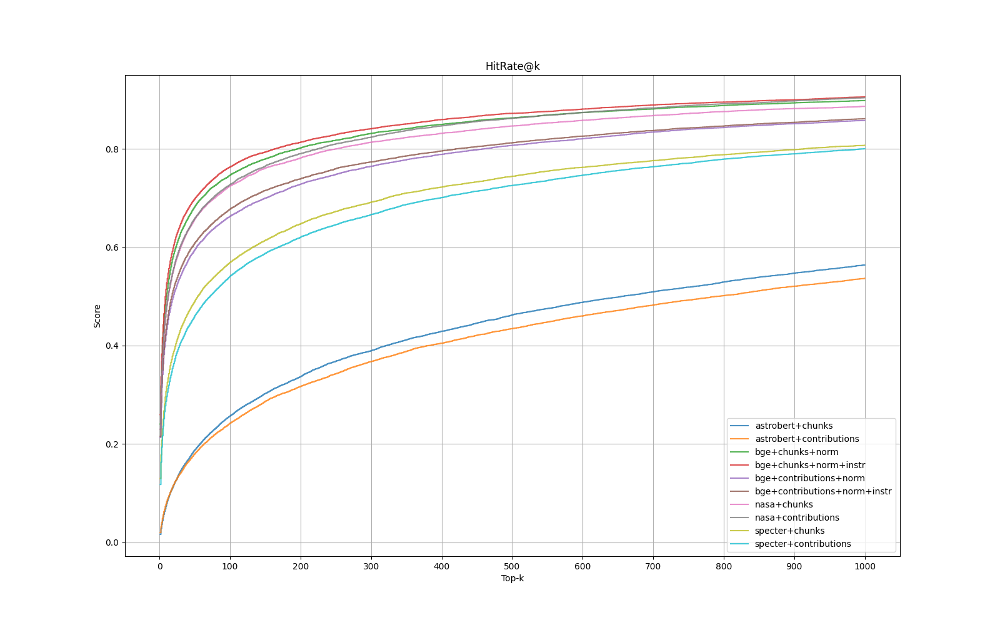

# Experimental Notes & Journal
### 1.2.26
Working on extending the ACL dataset
Cut some rows from the dataset because:
- They referred to papers not in the ACL Anthology
- They were actually obituaries or non-research papers
- They had target titles that were general journals rather than specific papers

### 12.19.25
Working on builing a 'titlemap' that maps all titles in a dataset (citing or target title) regardless of typos or variations to the canonical title in the dataset.
- The number of typos / errors / inconsistencies looks to be about 10% on ACL. The actual number of errors will be the number of keys in the titlemap minus number of unique values

### 12.17.25
Working on integrating arXiv and ACL Anthology datasets
- The datasets have a lot of typos in citing_title and target_title, requiring fuzzy matching to get the doc id from title
- I validated that they all are well-formed csv though, no missing fields
- I ought to write out a cleaned version of the datasets with:
  - cleaned titles
  - added doc ids for source and target docs
- Reference dataset: do we include all papers (citing and target) or only target papers?

### 9.11.25

#### Research
* Worked on difference vector experiments
  * Qwen 0.6B + contributions, L2 space, no significant change when adding the difference vector (0.810 hitrate@100 with difference vector vs 0.813 without)
  * Qwen 0.6B + chunks, L2 space, no significant change

#### 8.28.25

##### Research
* Compiled query expansion results for qwen 0.6 and bge. 
  * For bge, chunks+title performed best. For both chunks and contributions doc expansions, +title, +prev_3 and +prev_5 all improved performance over baseline while +abstract and +prev_7 degraded performance.
  * For qwen06 chunks+prev_3 performed best. However, all other query expansions paired with chunks degraded performance. Contributions benefitted from +prev_3, +prev_5, and +prev_7 but +title and +abstract hurt.

### Baseline

#### 6.17.25

Having chunked and embedded the research corpus using bge-small, bge-large, and astrobert, I set top-k to 1000 and performed vector search using 326 nontrivial examples from the training set.

Each example query and search result produces a Jaccard score (intersection over union) and a 'hit percentage' (proportion of target documents retrieved by the search, i.e. recall).

| Model       | Average IoU | Recall |
| ----------- | ----------- | ------ |
| `astrobert` | 0.0004      | 0.22   |
| `bge-small` | 0.0015      | 0.71   |
| `bge-large` | 0.0019      | 0.77   |

_Using `k = 1000`, cosine similarity on document chunks, IVFFlat index with 1000 probes_

### Document Expansion: representing papers by a list of their contributions

#### 6.17.25

With vanilla RAG and these embedding models it appears that we need a high `k` in order to retrieve the target documents, but more documents retrieved lowers average IoU. One way to address this would be to use document expansion by representing each paper as a list of strings comprising that paper's original contributions.

As a pilot attempt, I took 10 training examples (`small_train.jsonl`) which together cited 15 research papers. Those 15 papers I fed into DeepSeek-R1 prompting it to write out the paper's original contributions. This resulted in 154 individual 'contribution strings' which I embedded using `bge-large` (the best performing model in vanilla RAG), and inserted into a table on the database.

Performing top-20 vector similarity on this table resulted in an average IoU of 0.1860 and recall of 0.94. Part of this is likely due to the much smaller search space. However the 'original contribution' extraction also may serve to focus each paper's underlying citation value and I should try this method at a larger scale.

| Model       | Average IoU | Recall |
| ----------- | ----------- | ------ |
| `bge-large` | 0.0600      | 0.68   |

#### 8.20.25

Wrote `clean_dataset_refs.ipynb` to remove `[REF]` from datasets' inputs; this is not a token in any model vocabulary, so it's likely tokenizing to `'[', 'ref', ']'` which just adds noise. Re-running baseline experiments against the cleaned dataset.

The top-performing embedder has been BGE so far, which [states you should prepend short queries with an instruction](https://huggingface.co/BAAI/bge-large-en-v1.5) for embedding. I've implemented this as a type of query expansion, `add_bge_instruction`. If there is a meaningful improvement, perhaps this instruction should be moved into the `Embedder` subclass itself.

After running experiments with and without `[REF]` in the input sentence and with/without the added BGE instruction for queries:

- Removing the `[REF]` marker improved hitrate and recall in all cases
  - This indicates that `[REF]` was adding noise to the input, negatively impacting performance. Are there other 'noises' that could be removed, such as "()", stopwords, or other punctuation?
- Adding the BGE instruction also improved hitrate and recall by about 1% for most $k$.
  - Moved the instruction into the embedders so it is used by default during queries

##### Engineering

Refactored `Embedders` class:

- Constructors take a `for_query` flag to allow different query/document embedding logic if the model suggests it (e.g. BGE, Qwen)
- Created a decorator `@Embedder.register` to simplify the registration of new embedder classes. Now embedders instantiate from `Embedder.create` instead of an external `get_embedder` function

##### Research

Ran experiments on the dataset (`nontrivial_checked.jsonl`, 14735 examples) against chunks & contribution representations using the following embedders:

- astrobert
- bge_large
- nasa
- specter2

The top performing embedder was `bge_large` against chunks. Interestingly, the Nasa embedder against contributions came in 2nd, while BGE against contributions came in 3rd.

**Takeaway**:BGE, trained for document embedding, outperforms other science-tuned LLMs

#### 8.22.25

##### Engineering

* Refactored `MilvusDB.search` to apply pubdate filtering: Discovered that the `MilvusDB.search` method wasn't filtering based on pubdate. Additionally, only a client object can apply filters it seems, not collection objects, in `pymilvus`.
* Refactored `Metric` class and `RankFuser`

Still to do: Adapt experiment code that computes stats to run on a reranked dataset, then you can try rank fusers with multiple different values on the same experimental output

##### Research
* Reran baselines using updated search function: Qwen06B+chunks still top performer, followed by BGE+chunks, then Qwen06+contributions close behind. Qwen4B and Qwen8B likely would do even better

#### 8.23.25

##### Engineering

* Implemented rank fusion and various metric functions
* Worked on a separate component to compute search results statistics, so we can quickly config and rerank along various strategies and get their performance metrics

